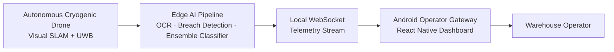

# ColdChain Drone-Ops

**An autonomous, zero-GPS sub-zero warehouse auditing infrastructure and companion Android-based monitoring gateway for climate-resilient logistics.**

> Production Repository Blueprint · Target Version `v2.0.0-Core-Spec` · Last Updated June 28, 2026 · Compliance: Decision No. 2229/QD-TTg


This repository expands an existing frontend prototype into a full-scale, production-ready system that bridges edge cryogenic robotics, computer vision, stacked machine-learning ensembles, and a real-time React Native mobile gateway.

---

## Table of Contents
- [Problem Landscape](#problem-landscape)
- [System Architecture & Innovation](#system-architecture--innovation)
- [High-Fidelity Android Interface UI](#high-fidelity-android-interface-ui)
- [Technical Specifications](#technical-specifications)
- [Core AI Models & Algorithmic Frameworks](#core-ai-models--algorithmic-frameworks)
- [Tech Stack](#tech-stack)
- [Project Composition](#project-composition)
- [24-Month Implementation Roadmap](#24-month-implementation-roadmap)
- [Repository Structure](#repository-structure)
- [Implementation Strategy & Next Steps](#implementation-strategy--next-steps)

---

## Problem Landscape

Vietnam's rising status as a premier agricultural exporter and biopharmaceutical hub has generated an acute infrastructure bottleneck — an estimated shortfall of 400,000 square meters of cold storage space nationwide. Existing facilities satisfy only 30–35% of total market demand, forcing warehouse operators to maximize volume through dense, multi-tier vertical racking systems.

This extreme asset utilization leads to critical operational failures:

- **Thermal Anomalies** — Undetected insulation breaches and structural heat leaks across dense racking.
- **Inventory Decay** — Delayed inventory updates, missing product batches, and regulatory noncompliance.
- **High Operational Cost** — Soaring electricity tariffs compounded by micro-climate anomalies such as frost over-accumulation.

ColdChain Drone-Ops addresses these systemic inefficiencies, contributing to a framework that aligns with **Decision No. 2229/QD-TTg** — Vietnam's directive for the digital transformation of 80% of logistics enterprises by 2035.

---

## System Architecture & Innovation

ColdChain Drone-Ops bridges the gap between rugged edge hardware and predictive logistics analytics through a dual-layer approach:

1. **Autonomous Cryogenic Fleet** — Drone nodes running localized **Visual SLAM** and Ultra-Wideband (UWB) positioning for structural navigation in zero-GPS, "lights-out" sub-zero (−25°C) environments.
2. **Android Operator Gateway** — A high-fidelity mobile application utilizing a **Stacked Ensemble Classifier** to process edge telemetry, predict packaging failures, and visualize real-time localized environmental tracking.



---

## High-Fidelity Android Interface UI

The frontend system mimics a five-frame smartphone deployment pipeline, mapping core edge-AI capabilities directly onto the operator UI:

- **Distributed Multi-Zone Thermal Profiling** — Real-time 3D micro-climate heat maps displaying localized insulation anomalies.
- **Frost & Ice Over-Accumulation Detection** — Live regional oversight of evaporator coil status across fragmented storage nodes.
- **AI Expiry & Batch-Code OCR Reader** — Autonomous string translation of heavily frosted labels to meet export compliance.
- **Intelligent Sealed-Packaging Breach Analysis** — Active computer vision flagging torn wrapping and structural damage on vertical tiers.
- **Zero-GPS Sub-Zero Visual SLAM Navigation** — Spatial tracking loops plotting empty storage slots in total darkness.

🔗 **[View the interactive Figma mockup](https://www.figma.com/make/ZyFXPQUK59LvWFqDKi0RVQ/cold-chain-drone-ops?fullscreen=1&t=efDqU62DpiUgkPbT-1&code-node-id=0-9)**

---

## Technical Specifications

### Hardware Architecture (Cryogenic Edge-Nodes)

- **Thermal-Sealed Chassis** — Aerogel-lined carbon fiber casing designed to trap processor heat and mitigate condensation during extreme temperature shifts.
- **Smart-Heat Power** — Self-heating LiPo battery arrays that prevent deep-freeze voltage drops, sustaining a stable 25-minute flight profile.
- **Cryogenic Vision Payload** — Integrated dual-sensor module with active anti-frost lens heaters:
  - *Radiometric Thermal Camera* — Pixel-by-pixel thermal gradient evaluation.
  - *4K Global Shutter Camera & LED Array* — Synchronized flash tracking for rapid high-speed OCR capture in dark environments.
- **Local Data-Fusion Transceiver** — Industrial dual-band Wi-Fi module streaming data directly via local network protocols, bypassing cloud latency.

---

## Core AI Models & Algorithmic Frameworks

ColdChain Drone-Ops addresses complex physics and visual obfuscation by embedding four tailored algorithmic layers directly onto the edge hardware and companion gateway.

### 1. Zero-GPS Sub-Zero Visual SLAM and UWB Spatial Optimization

In total darkness or featureless cold-storage environments, visual feature extraction suffers from extreme lens condensation and illumination decay. The position calculation engine overcomes this by solving a tightly-coupled optimization problem, fusing sensor streams from the onboard IMU, localized global-shutter optical flow, and an array of Ultra-Wideband (UWB) transceivers.

The state transformation vector estimates drone localization via a cost function that minimizes geometric error and time-of-flight distances concurrently:

$$E(x_k) = \sum ||x_k - f(x_{k-1}, u_k)||^2_{Q_k} + \sum ||d_{k,j} - ||p_k - a_j||||^2_{R_k}$$

| Symbol | Meaning |
| :--- | :--- |
| $x_k$ | Multi-axis vehicle state at step $k$ |
| $f(\cdot)$ | Kinematic motion model fed by IMU updates $u_k$ |
| $d_{k,j}$ | Measured time-of-flight distance to UWB anchor $a_j$ |
| $p_k$ | Extracted spatial coordinates of the drone node |
| $Q_k, R_k$ | Covariance matrices that dynamically scale weight assignments based on active lens-fogging parameters |

### 2. Stacked Ensemble Classifier for Micro-Climate Packaging Failure

Rather than relying on plain binary thresholds to flag damaged boxes, the Android Gateway runs a **Stacked Ensemble Classifier** that predicts structural package collapse risk by monitoring micro-climate gradients over vertical multi-tier shelving units.

- **Level 0 (base layer):** three heterogeneous classifiers — a gradient-boosted decision tree tracking rapid thermal deltas, a support vector machine computing localized humidity indexes, and a deep neural network analyzing structural deflection scores.
- **Level 1 (meta-classifier):** a constrained logistic regression variant that compiles the base outputs into an actionable anomaly probability.

$$P(\text{Failure}) = \sigma \left( \beta_0 + \beta_1 M_{\text{GBDT}}(T_{\Delta}) + \beta_2 M_{\text{SVM}}(H_{\text{idx}}) + \beta_3 M_{\text{DNN}}(D_{\text{score}}) \right)$$

Where $\sigma(z) = (1 + e^{-z})^{-1}$ maps predictions onto a zero-to-one warning gradient, with $T_{\Delta}$ (localized temperature fluctuations), $H_{\text{idx}}$ (relative air moisture ratios), and $D_{\text{score}}$ (visual compression metrics) as inputs.

### 3. Anti-Frost Label Decryption via Enhanced OCR

Thick sub-zero frost layers act as a high-frequency spatial noise filter on product labels. The `edge_ai/src/inference_ocr.py` engine runs an image-preprocessing pipeline to normalize inputs before character recognition, applying an adaptive contrast transform to the localized illumination matrix:

$$I_{\text{processed}}(x,y) = \frac{I_{\text{raw}}(x,y) - \mu_{\text{local}}(x,y)}{\sigma_{\text{local}}(x,y) + \epsilon} \cdot \alpha + \beta$$

This localized variance standardization isolates character profiles before the matrix is passed to a quantized, hardware-accelerated **MobileNetV3**-backbone text recognition module — accurately parsing barcodes and expiry text blocks to meet international export tracking standards.

### 4. Intelligent Sealed-Packaging Breach Analysis

Torn structural wrapping and broken plastic bindings on high-tier pallets are detected via an edge-optimized object detection model (**YOLOv8-nano**), trained with specialized anchors on the visual profiles of torn polymers, crinkled surfaces, and exposed inner corrugated cardboard. The localization layer identifies structural integrity loss via a customized loss function:

$$\mathcal{L}_{\text{detection}} = \lambda_{\text{box}} \mathcal{L}_{\text{CIoU}} + \lambda_{\text{cls}} \mathcal{L}_{\text{BCE}}$$

**Complete IoU (CIoU)** refines bounding boxes during drone inspection sweeps, while **Binary Cross-Entropy (BCE)** categorizes structural anomalies into minor tears, major punctures, or pallet-shifting hazards.

---

## Tech Stack

| Layer | Technology |
| :--- | :--- |
| Mobile Frontend | React Native (Expo), `react-native-svg`, WebSocket client |
| Edge AI / Computer Vision | Python, TensorFlow Lite, OpenCV, scikit-learn |
| Robotics & Firmware | ROS2 Nav2, C++, Arduino (`.ino`) |
| Spatial Positioning | Visual SLAM, Ultra-Wideband (UWB) ranging |
| Model Formats | `.tflite`, `.onnx` (quantized for edge inference) |

---

## Project Composition

Executing this infrastructure project requires a cross-functional organizational matrix:

| Role | Core Ownership Focus | Key KPI Deliverable |
| :--- | :--- | :--- |
| **Lead Robotics & Embedded Engineer** | Firmware execution, UWB-guided spatial anchoring, ROS2 Nav2 parameter tuning, and thermal chassis sensor integration. | Zero-GPS positional accuracy variance Δx, Δy ≤ ±5 cm |
| **AI & Computer Vision Scientist** | Quantization and deployment of YOLO-based packaging breach models, OCR model enhancement, and Stacked Ensemble codebases. | Inference frame latency ≤ 45 ms on edge hardware |
| **Mobile Systems Engineer** | React Native frontend implementation, interactive spatial visual mapping, WebSocket telemetry pipeline, and state management. | Zero-drop rendering pipelines under 60 Hz UI refresh rates |
| **Cold-Chain Logistics Compliance Expert** | Validation of analytics vectors against domestic and global standards, aligning frameworks with Decision No. 2229/QD-TTg. | Regulatory sign-off and multi-tier auditing capability |

---

## 24-Month Implementation Roadmap

| Phase | Activity Focus | Key Milestones & Integration Points | Timeline |
| :--- | :--- | :--- | :--- |
| **Phase 1** | Hardware & SLAM Design | Chassis development with Aerogel insulation, UWB multi-anchor alignment, and ROS2 baseline configuration. | Months 0 – 6 |
| **Phase 2** | Edge-AI Pipelines | Dataset annotation for frosted packaging, training of YOLOv8-nano models, and Ensemble implementation. | Months 5 – 12 |
| **Phase 3** | Mobile UI Gateway | React Native high-fidelity interface build-out, WebSockets layer creation, and 3D heat map compilation. | Months 10 – 16 |
| **Phase 4** | Field Pilot Testing | Live sub-zero tests at −25°C in dense logistics facilities, compliance tracking, and pipeline tuning. | Months 14 – 24 |

> Phases overlap intentionally — edge-AI development begins before hardware is finalized, and mobile UI work starts once early telemetry is available, so integration risk is surfaced early rather than at the end of the timeline.

---

## Repository Structure

| Path | Purpose |
| :--- | :--- |
| `docs/` | Architecture diagrams and regulatory compliance documentation |
| `data/` | Mock telemetry and sensor calibration baselines |
| `frontend/` | React Native (Expo) Android Operator Gateway |
| `edge_ai/` | Python-based computer vision and ML inference pipeline |
| `hardware_embedded/` | ROS2 navigation configs and embedded C++/Arduino firmware |

```text
coldchaindroneops_ai/
├── .gitignore
├── LICENSE
├── README.md                           # Main documentation with system entrypoints
├── docs/                                # Architecture blueprints, regulatory compliance maps
│   ├── system_architecture.svg
│   └── regulatory_alignment_vietnam.md
├── data/
│   ├── telemetry_mock.json             # Baseline multi-tier zero-GPS sensor tracking
│   └── calibration/                     # Camera matrices and UWB sensor anchor offsets
├── frontend/                            # Android Operator Gateway (React Native workspace)
│   ├── App.jsx                         # Main dashboard navigation & WebSocket handler
│   ├── package.json                    # Frontend production and development dependencies
│   ├── app.json                        # Expo/Native build configuration properties
│   └── src/                             # Modularized state, components, and styling
│       ├── components/                  # ThermalMap, FrostIndicator, BreachAlertCards
│       └── services/                    # WebSocketConsumer, TelemetryParser
├── edge_ai/                             # Embedded Edge-AI core analytics
│   ├── requirements.txt                # ML dependencies (TensorFlow Lite, OpenCV, scikit-learn)
│   ├── models/                          # Quantized network weights (.tflite / .onnx)
│   │   ├── ocr_anti_frost_v1.tflite
│   │   └── package_breach_yolov8n.tflite
│   └── src/
│       ├── inference_ocr.py            # Global-shutter localized text translation loops
│       ├── ensemble_classifier.py      # Stacked ensemble packaging failure prediction logic
│       └── image_preprocessing.py      # High-contrast thermal gradient adjustments
└── hardware_embedded/                   # Robotics & edge firmware controls
    ├── slam_config/                     # ROS2 launch configurations, UWB tag/anchor nodes
    │   └── nav2_params.yaml
    └── firmware/                        # Embedded C++ control loops
        ├── thermal_chassis_heaters.ino # Automated thermal payload & lens defroster loops
        └── uwb_transceiver_driver.cpp  # Localized high-frequency distance ranging matrix
```

---

## Getting Started

The `frontend/` workspace ships as a high-fidelity Expo-based prototype. Wiring it to the live `edge_ai/` WebSocket telemetry pipeline is tracked under [Implementation Strategy & Next Steps](#implementation-strategy--next-steps).

### Prerequisites
- Node.js (LTS) and npm
- Expo CLI (`npm install -g expo-cli`, or use `npx expo` directly)
- An Android device with [Expo Go](https://expo.dev/go) installed, or Android Studio for a native emulator build

### Run the Frontend Prototype
```bash
# Clone the repository
git clone <repo-url>
cd coldchaindroneops_ai/frontend

# Install dependencies
npm install

# Launch the Expo development server
npx expo start
```
Scan the QR code with the Expo Go app on an Android device, or press `a` in the terminal to launch a connected Android emulator.

---

## Implementation Strategy & Next Steps

To transition this repository into a fully production-ready framework, the following technical changes are next in line:

1. **Frontend Assembly** — Initialize a standalone `package.json` within `frontend/`. Include mandatory libraries such as `react-native-svg` to render the localized 3D micro-climate maps, alongside standard WebSocket network interfaces.
2. **AI Model Integration** — Populate `edge_ai/models/` with quantized `.tflite` files. Add operational code templates into `edge_ai/src/` so developers can verify runtime inference performance.
3. **Hardware Parameterization** — Add initial `nav2_params.yaml` configuration templates under `hardware_embedded/`. This establishes clear boundaries between structural robotics firmware and frontend data aggregation.

---

